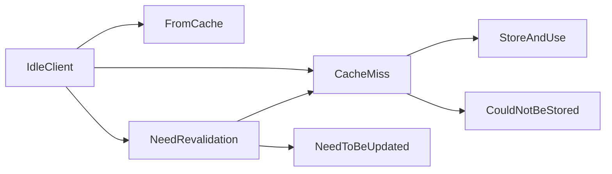

Hishel provides a sans-I/O implementation of the caching specification (RFC 9111), so you can plug in your own I/O—whether on the client or server side—to enable caching that follows the specification rules.

There’s a fully typed state machine that tells you what to do next. Here’s what it looks like:



As a client, start with an idle state and check the next method’s signature to understand what comes next.

```python
from hishel import IdleClient

state = IdleClient()

# signature will look like:
#   (method) def next(
#       request: Request,
#       associated_pairs: list[CompletePair]
#  )  -> (CacheMiss | FromCache | NeedRevalidation)
next_state = state.next(...)
```

In this example, `next_state` will be one of `CacheMiss`, `FromCache`, or `NeedRevalidation`, each exposing the appropriate signature for its next method.

## Configuration

Configure caching behavior by passing an options parameter when creating a `State`.

You can configure whether the implementation should assume responses are used in a shared cache, which HTTP methods to support, whether to serve stale responses, and more.

Import the CacheOptions class and pass it to the State, like so:

```python
from hishel import IdleClient, CacheOptions

state = IdleClient(
  options=CacheOptions(
    allow_stale=True
  )
)
```
