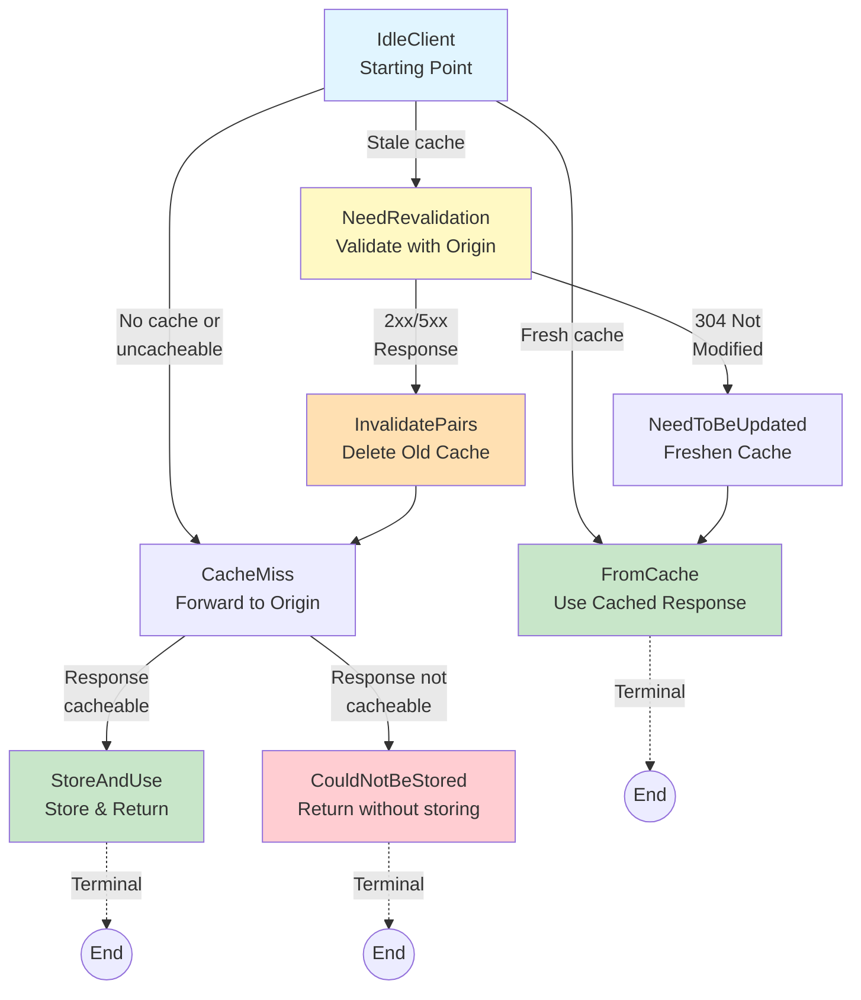

# HTTP Caching State Machine

Hishel provides a sans-I/O implementation of the HTTP caching specification (RFC 9111), allowing you to integrate RFC-compliant caching into any Python application—whether client-side or server-side.

The implementation uses an event-driven state machine that tells you exactly what to do next based on HTTP caching rules. You handle all I/O (network requests, storage operations), while the state machine ensures RFC 9111 compliance.

## Quick Start

```python
from hishel.beta import (
    # States
    IdleClient,
    CacheMiss,
    FromCache,
    NeedRevalidation,
    NeedToBeUpdated,
    StoreAndUse,
    CouldNotBeStored,
    InvalidatePairs,
    
    # Configuration
    CacheOptions,
    
    # Helper
    create_idle_state
)

# Create an idle state (starting point)
state = create_idle_state("client")  # "client" or "server" (server in development)

# The state machine guides you through the caching logic
next_state = state.next(request, associated_pairs=[])

# Each state has a specific signature for its next() method
# Type hints tell you exactly what parameters are needed
```

## How It Works

The state machine exposes RFC 9111 logic as a series of **states** and **transitions**. Each state represents a specific situation in the HTTP caching lifecycle:

1. **You provide**: HTTP requests, responses, and cached data
2. **State machine decides**: What action to take next
3. **You execute**: The I/O operations (network, storage)
4. **State machine validates**: Ensures RFC compliance

This design allows you to build HTTP caches that are:
- ✅ **Correct**: Fully compliant with RFC 9111
- ✅ **Testable**: Sans-I/O design enables easy testing
- ✅ **Flexible**: Works with any I/O library or framework
- ✅ **Type-safe**: Fully typed with clear state transitions

---

## State Transitions

The state machine follows a clear flow through different states based on HTTP caching rules defined in RFC 9111. Here's the complete transition map:



**Legend:**
- **Blue**: Entry state (IdleClient)
- **Green**: Success states (FromCache, StoreAndUse)
- **Red**: Failure state (CouldNotBeStored)
- **Yellow**: Intermediate states requiring I/O
- **Orange**: Action states (InvalidatePairs)

---

## State Flow Examples

### Example 1: Fresh Cache Hit
```
Request → IdleClient → FromCache → End
```
**Scenario:** Client requests `/api/users`, cache has fresh response  
**Actions:** Return cached response immediately, no origin contact

### Example 2: Cache Miss and Store
```
Request → IdleClient → CacheMiss → StoreAndUse → End
```
**Scenario:** First request for `/api/products`  
**Actions:** Forward to origin, receive cacheable response, store it, return to client

### Example 3: Cache Miss but Cannot Store
```
Request → IdleClient → CacheMiss → CouldNotBeStored → End
```
**Scenario:** Request `/api/private` with Authorization header, response has no cache directives  
**Actions:** Forward to origin, receive response with `no-store`, return without caching

### Example 4: Successful Revalidation (304)
```
Request → IdleClient → NeedRevalidation → NeedToBeUpdated → FromCache → End
```
**Scenario:** Cached `/api/data` is stale, origin confirms it's unchanged  
**Actions:** Send conditional request, receive 304, update cache metadata, return cached content

### Example 5: Failed Revalidation (200)
```
Request → IdleClient → NeedRevalidation → InvalidatePairs → CacheMiss → StoreAndUse → End
```
**Scenario:** Cached `/api/status` is stale, origin returns new content  
**Actions:** Send conditional request, receive 200 with new content, delete old cache, store new response

---


```python
from hishel.beta import create_idle_state

state = create_idle_state("client")  # client or server (server still in development)

# signature will look like:
#   (method) def next(
#       request: Request,
#       associated_pairs: list[CompletePair]
#  )  -> (CacheMiss | FromCache | NeedRevalidation)
next_state = state.next(...)
```

In this example, `next_state` will be one of `CacheMiss`, `FromCache`, or `NeedRevalidation`, each exposing the appropriate signature for its next method.

---

## States

The state machine implements RFC 9111 through a series of well-defined states. Each state represents a specific point in the HTTP caching lifecycle and determines the next action to take.

### IdleClient

**What it means:** The starting point of the cache state machine. This state represents an idle client that has received a request and needs to determine whether it can be satisfied from cache, needs revalidation, or must be forwarded to the origin server.

**When you're in this state:** 

- A new HTTP request has been received
- You need to check if cached responses exist
- You need to evaluate if cached responses can be used

**Transitions:**

- **→ FromCache**: A fresh cached response exists and can be used immediately without contacting the origin server
- **→ NeedRevalidation**: A stale cached response exists that requires validation with the origin server before use
- **→ CacheMiss**: No suitable cached response exists, or the request cannot be satisfied from cache

**RFC Reference:** [Section 4 - Constructing Responses from Caches](https://www.rfc-editor.org/rfc/rfc9111.html#section-4)

**Example:**
```python
from hishel.beta import IdleClient, CacheOptions

# Create idle state
idle = IdleClient(options=CacheOptions())

# Transition based on request and cached pairs
next_state = idle.next(request, associated_pairs=[])
# Returns: CacheMiss | FromCache | NeedRevalidation
```

---

### CacheMiss

**What it means:** The request cannot be satisfied from cache and must be forwarded to the origin server. After receiving the origin's response, this state evaluates whether the response can be stored in the cache.

**When you're in this state:**

- No suitable cached response exists for the request
- You've received a response from the origin server
- You need to determine if this response should be cached

**Transitions:**

- **→ StoreAndUse**: The response meets all RFC 9111 storage requirements and should be cached
- **→ CouldNotBeStored**: The response fails one or more storage requirements and cannot be cached

**Storage Requirements Checked:**

1. Request method is understood by the cache
2. Response status code is final (not 1xx)
3. Cache understands the response status code
4. No `no-store` directive present
5. `private` directive allows storage (for shared caches)
6. `Authorization` header is properly handled
7. Response contains explicit caching information OR is heuristically cacheable

**RFC Reference:** [Section 3 - Storing Responses in Caches](https://www.rfc-editor.org/rfc/rfc9111.html#section-3)

**Example:**
```python
from hishel.beta import CacheMiss

# After forwarding request to origin
cache_miss = CacheMiss(request=request, options=options)

# Evaluate response for storage
next_state = cache_miss.next(response, pair_id=uuid.uuid4())
# Returns: StoreAndUse | CouldNotBeStored
```

---

### NeedRevalidation

**What it means:** One or more stale cached responses exist for the request, but they cannot be used without validation. A conditional request must be sent to the origin server to check if the cached content is still valid.

**When you're in this state:**

- Cached responses exist but are stale (past their freshness lifetime)
- The responses have validators (ETag or Last-Modified)
- You've sent a conditional request to the origin (If-None-Match or If-Modified-Since)
- You're waiting for the validation response

**Transitions:**

- **→ NeedToBeUpdated**: Origin responds with 304 Not Modified - cached responses are still valid and can be freshened
- **→ InvalidatePairs + CacheMiss**: Origin responds with 2xx/5xx - cached responses are outdated and must be replaced
- **→ CacheMiss**: No matching responses found during the freshening process

**Validation Process:**

1. Client sends conditional request with validators from cached response
2. Origin server checks if content has changed
3. **304 response**: Content unchanged, update cache metadata
4. **2xx/5xx response**: Content changed or error, invalidate old cache and store new response

**RFC Reference:** [Section 4.3 - Validation](https://www.rfc-editor.org/rfc/rfc9111.html#section-4.3)

**Example:**
```python
from hishel.beta import NeedRevalidation

# After detecting stale cache
need_revalidation = NeedRevalidation(
    request=conditional_request,
    original_request=original_request,
    revalidating_pairs=[stale_pair],
    options=options
)

# Handle validation response
next_state = need_revalidation.next(validation_response)
# Returns: NeedToBeUpdated | InvalidatePairs | CacheMiss
```

---

### FromCache

**What it means:** A suitable cached response was found and can be used immediately to satisfy the request. No communication with the origin server is needed.

**When you're in this state:**
- A fresh cached response exists for the request
- The cached response matches all request requirements (Vary headers, etc.)
- The response is within its freshness lifetime OR stale responses are allowed

**Transitions:**

- **→ None**: This is a terminal state. Use the cached response to satisfy the request.

**What to do:**

1. Retrieve the cached response
2. Update the Age header to reflect current age
3. Return the response to the client
4. No further state transitions needed

**RFC Reference:** [Section 4.2 - Freshness](https://www.rfc-editor.org/rfc/rfc9111.html#section-4.2)

**Example:**
```python
from hishel.beta import FromCache

# When a fresh response is found
from_cache = FromCache(pair=cached_pair, options=options)

# This is a terminal state
assert from_cache.next() is None

# Use cached_pair.response to satisfy the request
```

---

### NeedToBeUpdated

**What it means:** The origin server responded with 304 Not Modified during revalidation. The cached responses are still valid but need their metadata refreshed with information from the 304 response.

**When you're in this state:**

- You received a 304 Not Modified response
- One or more cached responses match the validators
- The cached content is still valid but metadata needs updating

**Transitions:**

- **→ FromCache**: After updating cached responses, use them to satisfy the request

**Update Process:**

1. Match cached responses using validators (ETag or Last-Modified)
2. Update matched responses with new headers from 304 response
3. Preserve the cached response body (content hasn't changed)
4. Update freshness information (Date, Cache-Control, Expires)

**RFC Reference:** [Section 4.3.4 - Freshening Stored Responses](https://www.rfc-editor.org/rfc/rfc9111.html#section-4.3.4)

**Example:**
```python
from hishel.beta import NeedToBeUpdated

# After 304 Not Modified
need_update = NeedToBeUpdated(
    updating_pairs=[cached_pair],
    original_request=original_request,
    options=options
)

# Transition to FromCache
next_state = need_update.next()
# Returns: FromCache
```

---

### StoreAndUse

**What it means:** The response from the origin server meets all RFC 9111 storage requirements and should be saved to the cache. This is a terminal state indicating successful caching.

**When you're in this state:**

- You received a response from the origin server
- The response passed all storage validation checks
- The response should be cached for future requests

**Transitions:**

- **→ None**: This is a terminal state. Store the response and use it to satisfy the request.

**What to do:**

1. Store the request-response pair in your cache storage
2. Store any stream data (request/response bodies)
3. Return the response to the client
4. The response is now available for future requests

**RFC Reference:** [Section 3 - Storing Responses in Caches](https://www.rfc-editor.org/rfc/rfc9111.html#section-3)

**Example:**
```python
from hishel.beta import StoreAndUse

# After determining response is cacheable
store_and_use = StoreAndUse(
    pair_id=pair_id,
    response=response,
    options=options
)

# This is a terminal state
assert store_and_use.next() is None

# Store the pair and return the response
```

---

### CouldNotBeStored

**What it means:** The response from the origin server does not meet RFC 9111 storage requirements and cannot be cached. This is a terminal state indicating the response should be used but not stored.

**When you're in this state:**

- You received a response from the origin server
- The response failed one or more storage validation checks
- The response should be returned to the client but not cached

**Common Reasons:**

- Contains `no-store` cache directive
- Contains `private` directive (for shared caches)
- Method not supported for caching
- Status code not cacheable
- `Authorization` header without explicit caching permission
- No explicit caching directives and not heuristically cacheable

**Transitions:**

- **→ None**: This is a terminal state. Use the response without storing it.

**What to do:**

1. Return the response to the client
2. Do NOT store it in cache
3. Future identical requests will also result in cache miss

**RFC Reference:** [Section 3 - Storing Responses in Caches](https://www.rfc-editor.org/rfc/rfc9111.html#section-3)

**Example:**
```python
from hishel.beta import CouldNotBeStored

# After determining response is not cacheable
could_not_store = CouldNotBeStored(
    response=response,
    pair_id=pair_id,
    options=options
)

# This is a terminal state
assert could_not_store.next() is None

# Return response without storing
```

---

### InvalidatePairs

**What it means:** One or more cached response pairs need to be invalidated (deleted) from the cache before proceeding to the next state. This is a wrapper state that performs cleanup before transitioning.

**When you're in this state:**

- Outdated cached responses need to be removed
- You're proceeding to another state after cleanup
- This typically occurs during revalidation when new responses replace old ones

**Transitions:**

- **→ next_state**: After invalidating pairs, transition to the wrapped next state (typically `CacheMiss` or `NeedToBeUpdated`)

**Common Scenarios:**

1. **After 2xx response during revalidation**: Old cached responses are outdated, invalidate them before storing new response
2. **After 5xx error during revalidation**: Server error invalidates cached responses
3. **During freshening**: Responses that don't match validators need removal

**What to do:**

1. Delete the specified pairs from cache storage
2. Delete associated stream data
3. Transition to the next state specified

**Example:**
```python
from hishel.beta import InvalidatePairs, CacheMiss

# During revalidation with new response
invalidate = InvalidatePairs(
    pair_ids=[old_pair_id1, old_pair_id2],
    next_state=CacheMiss(request=request, options=options),
    options=options
)

# Get next state after invalidation
next_state = invalidate.next()
# Returns: The wrapped next_state (e.g., CacheMiss)
```

## Configuration

You can pass an options parameter to any state to control how it behaves in certain situations. This was primarily added to allow configuration for cases where the RFC does not explicitly specify the behavior. In some places, the RFC might say that a cache MIGHT do something; the `options` parameter lets you define how to handle such cases.

Import the CacheOptions class and pass it to the State, like so:

```python
from hishel.beta import IdleClient, CacheOptions

state = IdleClient(
  options=CacheOptions(
    allow_stale=True
  )
)
```
