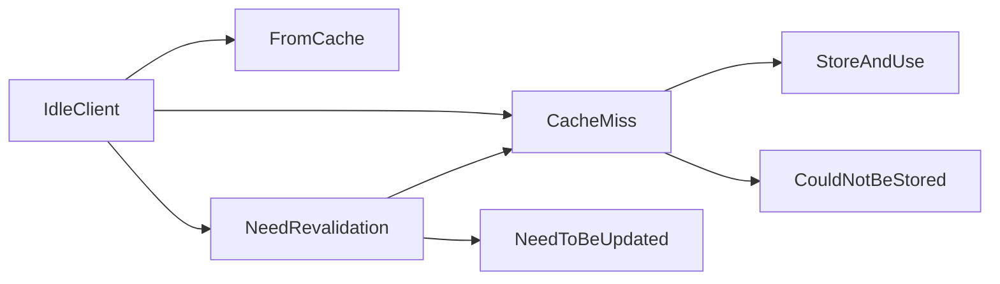

## Event-Driven State Machine Usage

Hishel provides a sans-I/O implementation of the caching specification (RFC 9111), so you can plug in your own I/O—whether on the client or server side—to enable caching that follows the specification rules.

There’s a fully typed state machine that tells you what to do next. Here’s what it looks like:

The state machine exposes the logic of RFC9111 as a series of states and transitions. You are responsible for all I/O (network, storage, etc.), while the state machine tells you what to do next.

This design allows you to build HTTP caches that are correct, testable, and decoupled from any particular I/O or framework.



As a client, start with an idle state and check the next method’s signature to understand what comes next.

```python
from hishel.beta import create_idle_state

state = create_idle_state("client")  # client or server (server still in development)

# signature will look like:
#   (method) def next(
#       request: Request,
#       associated_pairs: list[CompletePair]
#  )  -> (CacheMiss | FromCache | NeedRevalidation)
next_state = state.next(...)
```

In this example, `next_state` will be one of `CacheMiss`, `FromCache`, or `NeedRevalidation`, each exposing the appropriate signature for its next method.

## States

### IdleClient

This represents the state of an idle client that wants to reuse any stored responses whenever possible. The transition from this state follows the logic described in [section 4, Constructing Responses from Caches, of RFC 9111](https://www.rfc-editor.org/rfc/rfc9111.html#name-constructing-responses-from).

### CacheMiss

`CacheMiss` is the state that indicates the stored responses could not be used at all, even with revalidation. The transition logic for this state is described in section [3, Storing Responses in Caches, of RFC9111](https://www.rfc-editor.org/rfc/rfc9111.html#section-3). Here is a simple example of its usage:

### NeedRevalidation

`NeedRevalidation` indicates that there are responses that could be used for the request, but they must be revalidated first. The transition logic for this state is described in section [4.3, Validation, of RFC9111](https://www.rfc-editor.org/rfc/rfc9111.html#name-validation).

### FromCache

The `FromCache` state indicates that a stores response was found for the request and can be used without revalidation.

### NeedToBeUpdated

`NeedToBeUpdated` is a state very similar to `FromCache`. Like `FromCache`, it indicates that a response can be used for your request, but it also signals that some stored responses need to be refreshed.

### CouldNotBeStored

`CouldNotBeStored` is a state that indicates the response you are trying to store could not be saved and should be skipped.

### StoreAndUse

`StoreAndUse` is the opposite of `CouldNotBeStored`. It indicates that the response is storable according to the specification, so you can store it and then use it.

## Configuration

You can pass an options parameter to any state to control how it behaves in certain situations. This was primarily added to allow configuration for cases where the RFC does not explicitly specify the behavior. In some places, the RFC might say that a cache MIGHT do something; the `options` parameter lets you define how to handle such cases.

Import the CacheOptions class and pass it to the State, like so:

```python
from hishel.beta import IdleClient, CacheOptions

state = IdleClient(
  options=CacheOptions(
    allow_stale=True
  )
)
```
